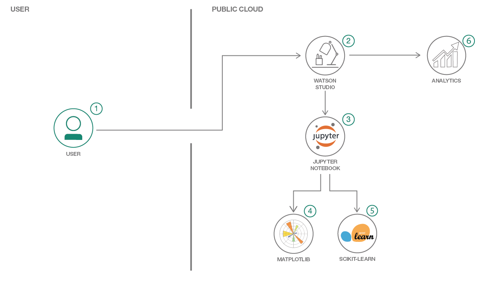
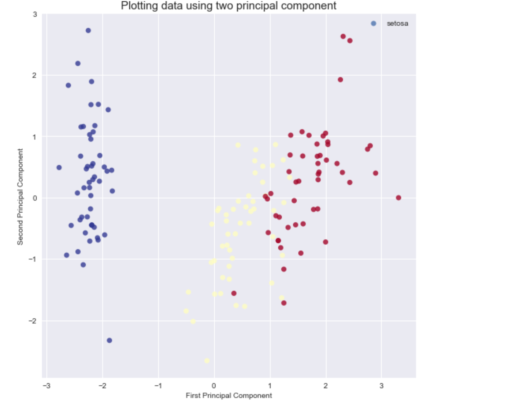
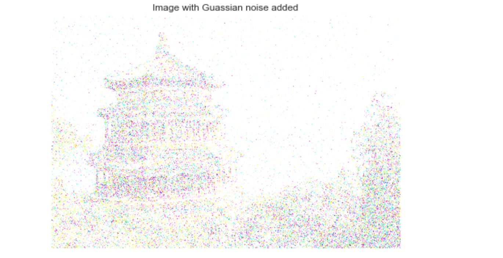
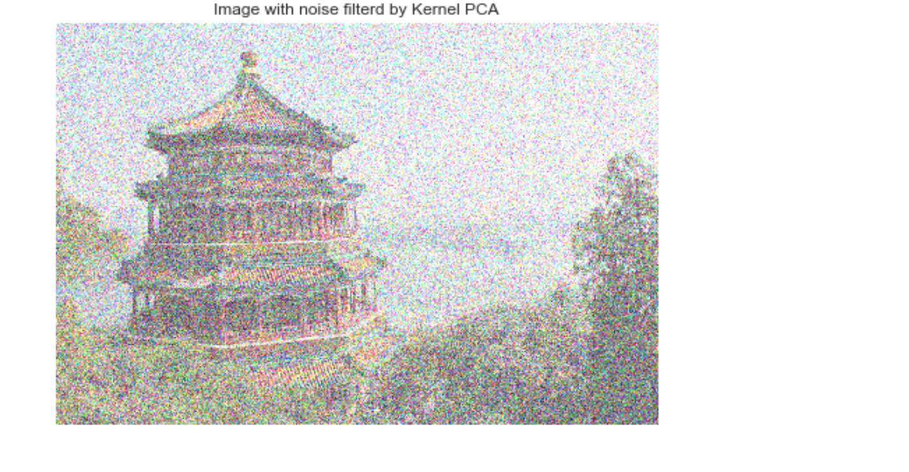

# Deep dive into Principal Component Analysis (PCA)

This code pattern will guide you through how to use `Scikit Learn` and `Python` in IBM Watson Studio. The goal is to use a Jupyter notebook to deep dive into Principal Component Analysis (PCA) using various datasets that are shipped with `Scikit Learn`.

We will first give a intuitive explanation of PCA and why it makes sense. Then we will go deeper into the actual derivation of Principal Components using the principle of maximizing the total projected variances onto components. Once we have understood the theory and concept, we will dive deeper into the use cases and examples. We will consider four scenarios with examples.

* Dimension Reduction
* Visualization
* Noise Filtering
* As a pre-processor for Machine Learning (ML) algorithms

In the end, we will summarize our discussion with links to PCA alternatives.

## Flow

1. Log into IBM Watson Studio service.
1. Create a Watson Studio project and add assets like Jupyter notebooks.
1. Launch a Jupyter notebook in Watson Studio.
1. Deep dive into intuition and theory of PCA.
1. Use Scikit Learn to work through 4 scenarios:
    * Dimension Reduction
    * Visualization
    * Noise Filtering
    * As a pre-processor for ML algorithms

## Included components

* [IBM Watson Studio](https://dataplatform.cloud.ibm.com/): Analyze data using RStudio, Jupyter, and Python in a configured, collaborative environment that includes IBM value-adds, such as managed Spark.
* [Jupyter Notebook](https://jupyter.org/): An open source web application that allows you to create and share documents that contain live code, equations, visualizations, and explanatory text.

## Featured technologies

* [Data Science](https://medium.com/ibm-data-science-experience/): Systems and scientific methods to analyze structured and unstructured data in order to extract knowledge and insights.
* [Python](https://www.python.org/): Python is a programming language that lets you work more quickly and integrate your systems more effectively.
* [Scikit Learn](https://scikit-learn.org/stable/):  A Python library for providing efficient tools for data mining and machine learning.
* [Matplotlib](https://matplotlib.org/): A Python library integrating matplot for visualization.

## Steps

This code pattern consists of following activities:

* [Run a Jupyter notebook in the IBM Watson Studio](#run-a-jupyter-notebook-in-the-ibm-watson-studio).
* [Deep Dive into Principal Component Analysis](#deep-dive-into-principal-component-analysis).

## Run a Jupyter notebook in the IBM Watson Studio

1. [Sign up for the Watson Studio](#1-sign-up-for-the-watson-studio)
1. [Create a new Watson Studio project](#2-create-a-new-watson-studio-project)
1. [Create the notebook](#3-create-the-notebook)
1. [Run the notebook](#4-run-the-notebook)
1. [Save and Share](#5-save-and-share)

### 1. Sign up for the Watson Studio

Log in or sign up for IBM's [Watson Studio](https://dataplatform.cloud.ibm.com/).

> Note: if you would prefer to skip the remaining Watson Studio set-up steps and just follow along by viewing the completed Notebook, simply:
> * View the completed [notebook](examples/deep_dive_pca.ipynb) and its outputs, as is.
> * While viewing the notebook, you can optionally download it to store for future use.
> * When complete, continue this code pattern by jumping ahead to the [PCA notebook contents](#pca-notebook-contents) section.

### 2. Create a new Watson Studio project

* Select the `New Project` option from the Watson Studio landing page and choose the `Data Science` option.

* Enter a name for the project name and click `Create`.

* **NOTE**: By creating a project in Watson Studio a free tier `Object Storage` service and `Watson Machine Learning` service will be created in your IBM Cloud account. Select the `Free` storage type to avoid fees.

  

* Upon a successful project creation, you are taken to a dashboard view of your project. Take note of the `Assets` and `Settings` tabs, we'll be using them to associate our project with any external assets (datasets and notebooks) and any IBM cloud services.

  

### 3. Create the Notebook

* From the new project `Overview` panel, click `+ Add to project` on the top right and choose the `Notebook` asset type.

  

* Fill in the following information:

  * Select the `From URL` tab. [1]
  * Enter a `Name` for the notebook and optionally a description. [2]
  * Under `Notebook URL` provide the following url: [https://github.com/IBM/pca-deep-dive-using-watson-studio/blob/master/notebooks/deep_dive_pca.ipynb](https://github.com/IBM/pca-deep-dive-using-watson-studio/blob/master/notebooks/deep_dive_pca.ipynb) [3]
  * For `Runtime` select the `Python 3.5` option. [4]

  

* Click the `Create` button.

* **TIP:** Once successfully imported, the notebook should appear in the `Notebooks` section of the `Assets` tab.

### 4. Run the notebook

When a notebook is executed, what is actually happening is that each code cell in
the notebook is executed, in order, from top to bottom.

Each code cell is selectable and is preceded by a tag in the left margin. The tag
format is `In [x]:`. Depending on the state of the notebook, the `x` can be:

* A blank, this indicates that the cell has never been executed.
* A number, this number represents the relative order this code step was executed.
* A `*`, this indicates that the cell is currently executing.

There are several ways to execute the code cells in your notebook:

* One cell at a time.
  * Select the cell, and then press the `Play` button in the toolbar.
* Batch mode, in sequential order.
  * From the `Cell` menu bar, there are several options available. For example, you
    can `Run All` cells in your notebook, or you can `Run All Below`, that will
    start executing from the first cell under the currently selected cell, and then
    continue executing all cells that follow.
* At a scheduled time.
  * Press the `Schedule` button located in the top right section of your notebook
    panel. Here you can schedule your notebook to be executed once at some future
    time, or repeatedly at your specified interval.

### 5. Save and Share

#### How to save your work:

Under the `File` menu, there are several ways to save your notebook:

* `Save` will simply save the current state of your notebook, without any version
  information.
* `Save Version` will save your current state of your notebook with a version tag
  that contains a date and time stamp. Up to 10 versions of your notebook can be
  saved, each one retrievable by selecting the `Revert To Version` menu item.

#### How to share your work:

You can share your notebook by selecting the `Share` button located in the top
right section of your notebook panel. The end result of this action will be a URL
link that will display a “read-only” version of your notebook. You have several
options to specify exactly what you want shared from your notebook:

* `Only text and output`: will remove all code cells from the notebook view.
* `All content excluding sensitive code cells`:  will remove any code cells
  that contain a *sensitive* tag. For example, `# @hidden_cell` is used to protect
  your credentials from being shared.
* `All content, including code`: displays the notebook as is.
* A variety of `download as` options are also available in the menu.

## PCA notebook contents

The notebook is well documented and will guide you through the exercise. Some of the main tasks that will be covered include:

### Principal Component Analysis (PCA) Intuition

Through various real life examples, we discuss the theory and intuition behind PCA.

### PCA Mathemathical Formulation

We cover the mathemathical foundation and derive the key ideas of PCA.

### Principal Component Analysis in Practice

We explore PCA through various examples. We will be using `Scikit-learn` and `matplotlib` to dive deep into the following examples:

* PCA for Dimension Reduction
* PCA for Visualization and Better Insights
* PCA for Noise Filtering
* PCA as a Preprocessor for ML algorithms

## Sample Output

The following screen-shot shows derivation of PCA by maximizing total projected variances:

The following screen-shot shows how you can do simple classification using PCA:

The following screen-shots shows how to de-noise a image using PCA:

Awesome job following along! Now go try and take this further or apply it to a different use case!

## Links

* [Watson Studio](https://dataplatform.cloud.ibm.com/docs/content/analyze-data/creating-notebooks.html)
* [Scikit Learn](http://scikit-learn.org/stable/)
* [Matplotlib](https://matplotlib.org/)
* [SeaBorn](https://seaborn.pydata.org)

## Learn more

* **Artificial Intelligence Code Patterns**: Enjoyed this Code Pattern? Check out our other [AI Code Patterns](https://developer.ibm.com/technologies/artificial-intelligence/).
* **Data Analytics Code Patterns**: Enjoyed this Code Pattern? Check out our other [Data Analytics Code Patterns](https://developer.ibm.com/technologies/data-science/)
* **AI and Data Code Pattern Playlist**: Bookmark our [playlist](https://www.youtube.com/playlist?list=PLzUbsvIyrNfknNewObx5N7uGZ5FKH0Fde) with all of our Code Pattern videos
* **With Watson**: Want to take your Watson app to the next level? Looking to utilize Watson Brand assets? [Join the With Watson program](https://www.ibm.com/watson/with-watson/) to leverage exclusive brand, marketing, and tech resources to amplify and accelerate your Watson embedded commercial solution.
* **Watson Studio**: Master the art of data science with IBM's [Watson Studio](https://dataplatform.cloud.ibm.com/)

## License

This code pattern is licensed under the Apache License, Version 2. Separate third-party code objects invoked within this code pattern are licensed by their respective providers pursuant to their own separate licenses. Contributions are subject to the [Developer Certificate of Origin, Version 1.1](https://developercertificate.org/) and the [Apache License, Version 2](https://www.apache.org/licenses/LICENSE-2.0.txt).

[Apache License FAQ](https://www.apache.org/foundation/license-faq.html#WhatDoesItMEAN)
